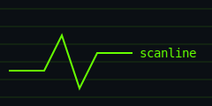
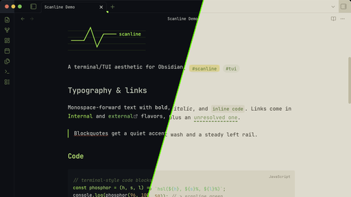

  

# Scanline

A terminal/TUI-inspired theme for [Obsidian](https://obsidian.md).

Scanline is a personal theme — I built it for myself and use it daily as the primary theme across several of my vaults and projects. It's calm and clean, with a retro CRT/TUI aesthetic: monospace-forward typography, quiet borders, and a palette that follows your accent color. I think it's readable, clean, and minimalistic — it doesn't do anything unneeded. I gladly publish it so more people have that option too.

## Look & feel

- **Dark mode** — near-black with a phosphor glow, monospace-forward typography, barely-there borders. Feels like a well-configured terminal.
- **Light mode** — warm paper tones, soft sepia ink. E-reader friendly and soothing on the eyes.
- **Accent-aware** — the whole palette (headings, links, tags, file tree, syntax) derives from your accent color. Defaults to a phosphor green; change it under **Settings → Appearance → Accent color** and the theme follows.
- Understated headings, terminal-style code blocks, monospace tag badges, thin scrollbars, quiet status bar.

## Typography

Scanline is monospace-forward by design. It uses the first of these it finds on your system: JetBrains Mono, SF Mono, Fira Code, Cascadia Code, Consolas. No fonts are bundled or fetched — set your favorite under **Settings → Appearance → Font** to override.

## Install

- **Community themes**: Settings → Appearance → Themes → Manage → search for "Scanline" *(once accepted into the directory)*.
- **Manual**: copy `theme.css` and `manifest.json` into `<your vault>/.obsidian/themes/Scanline/`, then select Scanline under Settings → Appearance.

## No bullshit

A simple theme and nothing else: no telemetry, no custom plugin systems, no ads, no obfuscated code, no remote assets. Just a bit of CSS, written from scratch.

## License

[MIT](LICENSE)
